# 🛡️ HackIT Autonomous AI Hunter Report

**Target:** `smkm1surabaya.sch.id`
**Scan Time:** `2026-06-10 13:30:10`

## 1. Executive Summary
The AI Hunter has successfully completed an autonomous attack simulation on smkm1surabaya.sch.id. The target is VULNERABLE. 42 active attack vectors were identified and successfully simulated.

## 2. Attack Vectors & Flowchart
### Vulnerability Flowchart: smkm1surabaya.sch.id

```mermaid
flowchart TD
    Target["🎯 smkm1surabaya.sch.id"]

    Port21_0("🔌 Port 21 (ftp)")
    Vuln21_0{"🧨 Anonymous FTP Login Check"}
    Impact21_0["🔥 Medium - Unauthorized Data Access"]
    Target --> Port21_0
    Port21_0 -- "Analyzed" --> Vuln21_0
    Vuln21_0 -. "Exploited" .-> Impact21_0

    style Impact21_0 fill:#f90,stroke:#333,stroke-width:2px,color:#fff
    Port443_1("🔌 Port 443 (http/https)")
    Vuln443_1{"🧨 Sensitive Endpoint Exposed: /.env.local (HTTP 403)"}
    Impact443_1["🔥 High - Data Leakage / RCE"]
    Target --> Port443_1
    Port443_1 -- "Analyzed" --> Vuln443_1
    Vuln443_1 -. "Exploited" .-> Impact443_1

    style Impact443_1 fill:#f00,stroke:#333,stroke-width:4px,color:#fff
    Port443_2("🔌 Port 443 (http/https)")
    Vuln443_2{"🧨 Sensitive Endpoint Exposed: /.git/ (HTTP 403)"}
    Impact443_2["🔥 High - Data Leakage / RCE"]
    Target --> Port443_2
    Port443_2 -- "Analyzed" --> Vuln443_2
    Vuln443_2 -. "Exploited" .-> Impact443_2

    style Impact443_2 fill:#f00,stroke:#333,stroke-width:4px,color:#fff
    Port443_3("🔌 Port 443 (http/https)")
    Vuln443_3{"🧨 Sensitive Endpoint Exposed: /.svn/ (HTTP 403)"}
    Impact443_3["🔥 High - Data Leakage / RCE"]
    Target --> Port443_3
    Port443_3 -- "Analyzed" --> Vuln443_3
    Vuln443_3 -. "Exploited" .-> Impact443_3

    style Impact443_3 fill:#f00,stroke:#333,stroke-width:4px,color:#fff
    Port443_4("🔌 Port 443 (http/https)")
    Vuln443_4{"🧨 Sensitive Endpoint Exposed: /.git/config (HTTP 403)"}
    Impact443_4["🔥 High - Data Leakage / RCE"]
    Target --> Port443_4
    Port443_4 -- "Analyzed" --> Vuln443_4
    Vuln443_4 -. "Exploited" .-> Impact443_4

    style Impact443_4 fill:#f00,stroke:#333,stroke-width:4px,color:#fff
    Port443_5("🔌 Port 443 (http/https)")
    Vuln443_5{"🧨 Sensitive Endpoint Exposed: /wp-config.php.bak (HTTP 403)"}
    Impact443_5["🔥 High - Data Leakage / RCE"]
    Target --> Port443_5
    Port443_5 -- "Analyzed" --> Vuln443_5
    Vuln443_5 -. "Exploited" .-> Impact443_5

    style Impact443_5 fill:#f00,stroke:#333,stroke-width:4px,color:#fff
    Port443_6("🔌 Port 443 (http/https)")
    Vuln443_6{"🧨 Sensitive Endpoint Exposed: /wp-config.php.save (HTTP 403)"}
    Impact443_6["🔥 High - Data Leakage / RCE"]
    Target --> Port443_6
    Port443_6 -- "Analyzed" --> Vuln443_6
    Vuln443_6 -. "Exploited" .-> Impact443_6

    style Impact443_6 fill:#f00,stroke:#333,stroke-width:4px,color:#fff
    Port443_7("🔌 Port 443 (http/https)")
    Vuln443_7{"🧨 Sensitive Endpoint Exposed: /.env (HTTP 403)"}
    Impact443_7["🔥 High - Data Leakage / RCE"]
    Target --> Port443_7
    Port443_7 -- "Analyzed" --> Vuln443_7
    Vuln443_7 -. "Exploited" .-> Impact443_7

    style Impact443_7 fill:#f00,stroke:#333,stroke-width:4px,color:#fff
    Port80_8("🔌 Port 80 (http/https)")
    Vuln80_8{"🧨 Sensitive Endpoint Exposed: /config.php.bak (HTTP 301)"}
    Impact80_8["🔥 High - Data Leakage / RCE"]
    Target --> Port80_8
    Port80_8 -- "Analyzed" --> Vuln80_8
    Vuln80_8 -. "Exploited" .-> Impact80_8

    style Impact80_8 fill:#f00,stroke:#333,stroke-width:4px,color:#fff
    Port80_9("🔌 Port 80 (http/https)")
    Vuln80_9{"🧨 Sensitive Endpoint Exposed: /wp-config.php.save (HTTP 301)"}
    Impact80_9["🔥 High - Data Leakage / RCE"]
    Target --> Port80_9
    Port80_9 -- "Analyzed" --> Vuln80_9
    Vuln80_9 -. "Exploited" .-> Impact80_9

    style Impact80_9 fill:#f00,stroke:#333,stroke-width:4px,color:#fff
    Port80_10("🔌 Port 80 (http/https)")
    Vuln80_10{"🧨 Sensitive Endpoint Exposed: /.env.local (HTTP 301)"}
    Impact80_10["🔥 High - Data Leakage / RCE"]
    Target --> Port80_10
    Port80_10 -- "Analyzed" --> Vuln80_10
    Vuln80_10 -. "Exploited" .-> Impact80_10

    style Impact80_10 fill:#f00,stroke:#333,stroke-width:4px,color:#fff
    Port80_11("🔌 Port 80 (http/https)")
    Vuln80_11{"🧨 Sensitive Endpoint Exposed: /.svn/ (HTTP 403)"}
    Impact80_11["🔥 High - Data Leakage / RCE"]
    Target --> Port80_11
    Port80_11 -- "Analyzed" --> Vuln80_11
    Vuln80_11 -. "Exploited" .-> Impact80_11

    style Impact80_11 fill:#f00,stroke:#333,stroke-width:4px,color:#fff
    Port80_12("🔌 Port 80 (http/https)")
    Vuln80_12{"🧨 Sensitive Endpoint Exposed: /backup.tar.gz (HTTP 301)"}
    Impact80_12["🔥 High - Data Leakage / RCE"]
    Target --> Port80_12
    Port80_12 -- "Analyzed" --> Vuln80_12
    Vuln80_12 -. "Exploited" .-> Impact80_12

    style Impact80_12 fill:#f00,stroke:#333,stroke-width:4px,color:#fff
    Port80_13("🔌 Port 80 (http/https)")
    Vuln80_13{"🧨 Sensitive Endpoint Exposed: /.git/ (HTTP 403)"}
    Impact80_13["🔥 High - Data Leakage / RCE"]
    Target --> Port80_13
    Port80_13 -- "Analyzed" --> Vuln80_13
    Vuln80_13 -. "Exploited" .-> Impact80_13

    style Impact80_13 fill:#f00,stroke:#333,stroke-width:4px,color:#fff
    Port80_14("🔌 Port 80 (http/https)")
    Vuln80_14{"🧨 Sensitive Endpoint Exposed: /.env.dev (HTTP 301)"}
    Impact80_14["🔥 High - Data Leakage / RCE"]
    Target --> Port80_14
    Port80_14 -- "Analyzed" --> Vuln80_14
    Vuln80_14 -. "Exploited" .-> Impact80_14

    style Impact80_14 fill:#f00,stroke:#333,stroke-width:4px,color:#fff
    Port80_15("🔌 Port 80 (http/https)")
    Vuln80_15{"🧨 Sensitive Endpoint Exposed: /dump.sql (HTTP 301)"}
    Impact80_15["🔥 High - Data Leakage / RCE"]
    Target --> Port80_15
    Port80_15 -- "Analyzed" --> Vuln80_15
    Vuln80_15 -. "Exploited" .-> Impact80_15

    style Impact80_15 fill:#f00,stroke:#333,stroke-width:4px,color:#fff
    Port80_16("🔌 Port 80 (http/https)")
    Vuln80_16{"🧨 Sensitive Endpoint Exposed: /.git/config (HTTP 403)"}
    Impact80_16["🔥 High - Data Leakage / RCE"]
    Target --> Port80_16
    Port80_16 -- "Analyzed" --> Vuln80_16
    Vuln80_16 -. "Exploited" .-> Impact80_16

    style Impact80_16 fill:#f00,stroke:#333,stroke-width:4px,color:#fff
    Port80_17("🔌 Port 80 (http/https)")
    Vuln80_17{"🧨 Sensitive Endpoint Exposed: /.env (HTTP 301)"}
    Impact80_17["🔥 High - Data Leakage / RCE"]
    Target --> Port80_17
    Port80_17 -- "Analyzed" --> Vuln80_17
    Vuln80_17 -. "Exploited" .-> Impact80_17

    style Impact80_17 fill:#f00,stroke:#333,stroke-width:4px,color:#fff
    Port80_18("🔌 Port 80 (http/https)")
    Vuln80_18{"🧨 Sensitive Endpoint Exposed: /.env.backup (HTTP 301)"}
    Impact80_18["🔥 High - Data Leakage / RCE"]
    Target --> Port80_18
    Port80_18 -- "Analyzed" --> Vuln80_18
    Vuln80_18 -. "Exploited" .-> Impact80_18

    style Impact80_18 fill:#f00,stroke:#333,stroke-width:4px,color:#fff
    Port80_19("🔌 Port 80 (http/https)")
    Vuln80_19{"🧨 Sensitive Endpoint Exposed: /.idea/ (HTTP 301)"}
    Impact80_19["🔥 High - Data Leakage / RCE"]
    Target --> Port80_19
    Port80_19 -- "Analyzed" --> Vuln80_19
    Vuln80_19 -. "Exploited" .-> Impact80_19

    style Impact80_19 fill:#f00,stroke:#333,stroke-width:4px,color:#fff
    Port80_20("🔌 Port 80 (http/https)")
    Vuln80_20{"🧨 Sensitive Endpoint Exposed: /database.sql (HTTP 301)"}
    Impact80_20["🔥 High - Data Leakage / RCE"]
    Target --> Port80_20
    Port80_20 -- "Analyzed" --> Vuln80_20
    Vuln80_20 -. "Exploited" .-> Impact80_20

    style Impact80_20 fill:#f00,stroke:#333,stroke-width:4px,color:#fff
    Port80_21("🔌 Port 80 (http/https)")
    Vuln80_21{"🧨 Sensitive Endpoint Exposed: /wp-config.php.bak (HTTP 301)"}
    Impact80_21["🔥 High - Data Leakage / RCE"]
    Target --> Port80_21
    Port80_21 -- "Analyzed" --> Vuln80_21
    Vuln80_21 -. "Exploited" .-> Impact80_21

    style Impact80_21 fill:#f00,stroke:#333,stroke-width:4px,color:#fff
    Port80_22("🔌 Port 80 (http/https)")
    Vuln80_22{"🧨 Sensitive Endpoint Exposed: /server-status (HTTP 301)"}
    Impact80_22["🔥 High - Data Leakage / RCE"]
    Target --> Port80_22
    Port80_22 -- "Analyzed" --> Vuln80_22
    Vuln80_22 -. "Exploited" .-> Impact80_22

    style Impact80_22 fill:#f00,stroke:#333,stroke-width:4px,color:#fff
    Port80_23("🔌 Port 80 (http/https)")
    Vuln80_23{"🧨 Sensitive Endpoint Exposed: /backup.sql (HTTP 301)"}
    Impact80_23["🔥 High - Data Leakage / RCE"]
    Target --> Port80_23
    Port80_23 -- "Analyzed" --> Vuln80_23
    Vuln80_23 -. "Exploited" .-> Impact80_23

    style Impact80_23 fill:#f00,stroke:#333,stroke-width:4px,color:#fff
    Port80_24("🔌 Port 80 (http/https)")
    Vuln80_24{"🧨 Sensitive Endpoint Exposed: /.vscode/ (HTTP 301)"}
    Impact80_24["🔥 High - Data Leakage / RCE"]
    Target --> Port80_24
    Port80_24 -- "Analyzed" --> Vuln80_24
    Vuln80_24 -. "Exploited" .-> Impact80_24

    style Impact80_24 fill:#f00,stroke:#333,stroke-width:4px,color:#fff
    Port80_25("🔌 Port 80 (http/https)")
    Vuln80_25{"🧨 Sensitive Endpoint Exposed: /phpinfo.php (HTTP 301)"}
    Impact80_25["🔥 High - Data Leakage / RCE"]
    Target --> Port80_25
    Port80_25 -- "Analyzed" --> Vuln80_25
    Vuln80_25 -. "Exploited" .-> Impact80_25

    style Impact80_25 fill:#f00,stroke:#333,stroke-width:4px,color:#fff
    Port80_26("🔌 Port 80 (http/https)")
    Vuln80_26{"🧨 Sensitive Endpoint Exposed: /backup.zip (HTTP 301)"}
    Impact80_26["🔥 High - Data Leakage / RCE"]
    Target --> Port80_26
    Port80_26 -- "Analyzed" --> Vuln80_26
    Vuln80_26 -. "Exploited" .-> Impact80_26

    style Impact80_26 fill:#f00,stroke:#333,stroke-width:4px,color:#fff
    Port80_27("🔌 Port 80 (http/https)")
    Vuln80_27{"🧨 Sensitive Endpoint Exposed: /db.sql (HTTP 301)"}
    Impact80_27["🔥 High - Data Leakage / RCE"]
    Target --> Port80_27
    Port80_27 -- "Analyzed" --> Vuln80_27
    Vuln80_27 -. "Exploited" .-> Impact80_27

    style Impact80_27 fill:#f00,stroke:#333,stroke-width:4px,color:#fff
    Port80_28("🔌 Port 80 (http/https)")
    Vuln80_28{"🧨 Sensitive Endpoint Exposed: /administrator/ (HTTP 301)"}
    Impact80_28["🔥 High - Data Leakage / RCE"]
    Target --> Port80_28
    Port80_28 -- "Analyzed" --> Vuln80_28
    Vuln80_28 -. "Exploited" .-> Impact80_28

    style Impact80_28 fill:#f00,stroke:#333,stroke-width:4px,color:#fff
    Port80_29("🔌 Port 80 (http/https)")
    Vuln80_29{"🧨 Sensitive Endpoint Exposed: /admin/ (HTTP 301)"}
    Impact80_29["🔥 High - Data Leakage / RCE"]
    Target --> Port80_29
    Port80_29 -- "Analyzed" --> Vuln80_29
    Vuln80_29 -. "Exploited" .-> Impact80_29

    style Impact80_29 fill:#f00,stroke:#333,stroke-width:4px,color:#fff
    Port80_30("🔌 Port 80 (http/https)")
    Vuln80_30{"🧨 Sensitive Endpoint Exposed: /login/ (HTTP 301)"}
    Impact80_30["🔥 High - Data Leakage / RCE"]
    Target --> Port80_30
    Port80_30 -- "Analyzed" --> Vuln80_30
    Vuln80_30 -. "Exploited" .-> Impact80_30

    style Impact80_30 fill:#f00,stroke:#333,stroke-width:4px,color:#fff
    Port80_31("🔌 Port 80 (http/https)")
    Vuln80_31{"🧨 Sensitive Endpoint Exposed: /swagger-ui.html (HTTP 301)"}
    Impact80_31["🔥 High - Data Leakage / RCE"]
    Target --> Port80_31
    Port80_31 -- "Analyzed" --> Vuln80_31
    Vuln80_31 -. "Exploited" .-> Impact80_31

    style Impact80_31 fill:#f00,stroke:#333,stroke-width:4px,color:#fff
    Port80_32("🔌 Port 80 (http/https)")
    Vuln80_32{"🧨 Sensitive Endpoint Exposed: /dashboard/ (HTTP 301)"}
    Impact80_32["🔥 High - Data Leakage / RCE"]
    Target --> Port80_32
    Port80_32 -- "Analyzed" --> Vuln80_32
    Vuln80_32 -. "Exploited" .-> Impact80_32

    style Impact80_32 fill:#f00,stroke:#333,stroke-width:4px,color:#fff
    Port80_33("🔌 Port 80 (http/https)")
    Vuln80_33{"🧨 Sensitive Endpoint Exposed: /actuator/env (HTTP 301)"}
    Impact80_33["🔥 High - Data Leakage / RCE"]
    Target --> Port80_33
    Port80_33 -- "Analyzed" --> Vuln80_33
    Vuln80_33 -. "Exploited" .-> Impact80_33

    style Impact80_33 fill:#f00,stroke:#333,stroke-width:4px,color:#fff
    Port80_34("🔌 Port 80 (http/https)")
    Vuln80_34{"🧨 Sensitive Endpoint Exposed: /api/v1/users.json (HTTP 301)"}
    Impact80_34["🔥 High - Data Leakage / RCE"]
    Target --> Port80_34
    Port80_34 -- "Analyzed" --> Vuln80_34
    Vuln80_34 -. "Exploited" .-> Impact80_34

    style Impact80_34 fill:#f00,stroke:#333,stroke-width:4px,color:#fff
    Port80_35("🔌 Port 80 (http/https)")
    Vuln80_35{"🧨 Sensitive Endpoint Exposed: /info.php (HTTP 301)"}
    Impact80_35["🔥 High - Data Leakage / RCE"]
    Target --> Port80_35
    Port80_35 -- "Analyzed" --> Vuln80_35
    Vuln80_35 -. "Exploited" .-> Impact80_35

    style Impact80_35 fill:#f00,stroke:#333,stroke-width:4px,color:#fff
    Port80_36("🔌 Port 80 (http/https)")
    Vuln80_36{"🧨 Sensitive Endpoint Exposed: /v2/api-docs (HTTP 301)"}
    Impact80_36["🔥 High - Data Leakage / RCE"]
    Target --> Port80_36
    Port80_36 -- "Analyzed" --> Vuln80_36
    Vuln80_36 -. "Exploited" .-> Impact80_36

    style Impact80_36 fill:#f00,stroke:#333,stroke-width:4px,color:#fff
    Port80_37("🔌 Port 80 (http/https)")
    Vuln80_37{"🧨 Sensitive Endpoint Exposed: /actuator/health (HTTP 301)"}
    Impact80_37["🔥 High - Data Leakage / RCE"]
    Target --> Port80_37
    Port80_37 -- "Analyzed" --> Vuln80_37
    Vuln80_37 -. "Exploited" .-> Impact80_37

    style Impact80_37 fill:#f00,stroke:#333,stroke-width:4px,color:#fff
    Port80_38("🔌 Port 80 (http/https)")
    Vuln80_38{"🧨 Sensitive Endpoint Exposed: /wp-admin/admin-ajax.php (HTTP 301)"}
    Impact80_38["🔥 High - Data Leakage / RCE"]
    Target --> Port80_38
    Port80_38 -- "Analyzed" --> Vuln80_38
    Vuln80_38 -. "Exploited" .-> Impact80_38

    style Impact80_38 fill:#f00,stroke:#333,stroke-width:4px,color:#fff
    Port80_39("🔌 Port 80 (http/https)")
    Vuln80_39{"🧨 Sensitive Endpoint Exposed: /graphql (HTTP 301)"}
    Impact80_39["🔥 High - Data Leakage / RCE"]
    Target --> Port80_39
    Port80_39 -- "Analyzed" --> Vuln80_39
    Vuln80_39 -. "Exploited" .-> Impact80_39

    style Impact80_39 fill:#f00,stroke:#333,stroke-width:4px,color:#fff
    Port80_40("🔌 Port 80 (http/https)")
    Vuln80_40{"🧨 Sensitive Endpoint Exposed: /api/v1/users (HTTP 301)"}
    Impact80_40["🔥 High - Data Leakage / RCE"]
    Target --> Port80_40
    Port80_40 -- "Analyzed" --> Vuln80_40
    Vuln80_40 -. "Exploited" .-> Impact80_40

    style Impact80_40 fill:#f00,stroke:#333,stroke-width:4px,color:#fff
    Port3306_41("🔌 Port 3306 (mysql)")
    Vuln3306_41{"🧨 MySQL Default Credentials / Blank Password Check"}
    Impact3306_41["🔥 Critical - Database Compromise"]
    Target --> Port3306_41
    Port3306_41 -- "Analyzed" --> Vuln3306_41
    Vuln3306_41 -. "Exploited" .-> Impact3306_41

    style Impact3306_41 fill:#f00,stroke:#333,stroke-width:4px,color:#fff
```

## 3. Detailed Findings
### 3.1. Anonymous FTP Login Check on Port 21
- **Service:** ftp
- **Impact:** Medium - Unauthorized Data Access
- **Status:** `Verified by AI`

### 3.2. Sensitive Endpoint Exposed: /.env.local (HTTP 403) on Port 443
- **Service:** http/https
- **Impact:** High - Data Leakage / RCE
- **Status:** `Verified by AI`

### 3.3. Sensitive Endpoint Exposed: /.git/ (HTTP 403) on Port 443
- **Service:** http/https
- **Impact:** High - Data Leakage / RCE
- **Status:** `Verified by AI`

### 3.4. Sensitive Endpoint Exposed: /.svn/ (HTTP 403) on Port 443
- **Service:** http/https
- **Impact:** High - Data Leakage / RCE
- **Status:** `Verified by AI`

### 3.5. Sensitive Endpoint Exposed: /.git/config (HTTP 403) on Port 443
- **Service:** http/https
- **Impact:** High - Data Leakage / RCE
- **Status:** `Verified by AI`

### 3.6. Sensitive Endpoint Exposed: /wp-config.php.bak (HTTP 403) on Port 443
- **Service:** http/https
- **Impact:** High - Data Leakage / RCE
- **Status:** `Verified by AI`

### 3.7. Sensitive Endpoint Exposed: /wp-config.php.save (HTTP 403) on Port 443
- **Service:** http/https
- **Impact:** High - Data Leakage / RCE
- **Status:** `Verified by AI`

### 3.8. Sensitive Endpoint Exposed: /.env (HTTP 403) on Port 443
- **Service:** http/https
- **Impact:** High - Data Leakage / RCE
- **Status:** `Verified by AI`

### 3.9. Sensitive Endpoint Exposed: /config.php.bak (HTTP 301) on Port 80
- **Service:** http/https
- **Impact:** High - Data Leakage / RCE
- **Status:** `Verified by AI`

### 3.10. Sensitive Endpoint Exposed: /wp-config.php.save (HTTP 301) on Port 80
- **Service:** http/https
- **Impact:** High - Data Leakage / RCE
- **Status:** `Verified by AI`

### 3.11. Sensitive Endpoint Exposed: /.env.local (HTTP 301) on Port 80
- **Service:** http/https
- **Impact:** High - Data Leakage / RCE
- **Status:** `Verified by AI`

### 3.12. Sensitive Endpoint Exposed: /.svn/ (HTTP 403) on Port 80
- **Service:** http/https
- **Impact:** High - Data Leakage / RCE
- **Status:** `Verified by AI`

### 3.13. Sensitive Endpoint Exposed: /backup.tar.gz (HTTP 301) on Port 80
- **Service:** http/https
- **Impact:** High - Data Leakage / RCE
- **Status:** `Verified by AI`

### 3.14. Sensitive Endpoint Exposed: /.git/ (HTTP 403) on Port 80
- **Service:** http/https
- **Impact:** High - Data Leakage / RCE
- **Status:** `Verified by AI`

### 3.15. Sensitive Endpoint Exposed: /.env.dev (HTTP 301) on Port 80
- **Service:** http/https
- **Impact:** High - Data Leakage / RCE
- **Status:** `Verified by AI`

### 3.16. Sensitive Endpoint Exposed: /dump.sql (HTTP 301) on Port 80
- **Service:** http/https
- **Impact:** High - Data Leakage / RCE
- **Status:** `Verified by AI`

### 3.17. Sensitive Endpoint Exposed: /.git/config (HTTP 403) on Port 80
- **Service:** http/https
- **Impact:** High - Data Leakage / RCE
- **Status:** `Verified by AI`

### 3.18. Sensitive Endpoint Exposed: /.env (HTTP 301) on Port 80
- **Service:** http/https
- **Impact:** High - Data Leakage / RCE
- **Status:** `Verified by AI`

### 3.19. Sensitive Endpoint Exposed: /.env.backup (HTTP 301) on Port 80
- **Service:** http/https
- **Impact:** High - Data Leakage / RCE
- **Status:** `Verified by AI`

### 3.20. Sensitive Endpoint Exposed: /.idea/ (HTTP 301) on Port 80
- **Service:** http/https
- **Impact:** High - Data Leakage / RCE
- **Status:** `Verified by AI`

### 3.21. Sensitive Endpoint Exposed: /database.sql (HTTP 301) on Port 80
- **Service:** http/https
- **Impact:** High - Data Leakage / RCE
- **Status:** `Verified by AI`

### 3.22. Sensitive Endpoint Exposed: /wp-config.php.bak (HTTP 301) on Port 80
- **Service:** http/https
- **Impact:** High - Data Leakage / RCE
- **Status:** `Verified by AI`

### 3.23. Sensitive Endpoint Exposed: /server-status (HTTP 301) on Port 80
- **Service:** http/https
- **Impact:** High - Data Leakage / RCE
- **Status:** `Verified by AI`

### 3.24. Sensitive Endpoint Exposed: /backup.sql (HTTP 301) on Port 80
- **Service:** http/https
- **Impact:** High - Data Leakage / RCE
- **Status:** `Verified by AI`

### 3.25. Sensitive Endpoint Exposed: /.vscode/ (HTTP 301) on Port 80
- **Service:** http/https
- **Impact:** High - Data Leakage / RCE
- **Status:** `Verified by AI`

### 3.26. Sensitive Endpoint Exposed: /phpinfo.php (HTTP 301) on Port 80
- **Service:** http/https
- **Impact:** High - Data Leakage / RCE
- **Status:** `Verified by AI`

### 3.27. Sensitive Endpoint Exposed: /backup.zip (HTTP 301) on Port 80
- **Service:** http/https
- **Impact:** High - Data Leakage / RCE
- **Status:** `Verified by AI`

### 3.28. Sensitive Endpoint Exposed: /db.sql (HTTP 301) on Port 80
- **Service:** http/https
- **Impact:** High - Data Leakage / RCE
- **Status:** `Verified by AI`

### 3.29. Sensitive Endpoint Exposed: /administrator/ (HTTP 301) on Port 80
- **Service:** http/https
- **Impact:** High - Data Leakage / RCE
- **Status:** `Verified by AI`

### 3.30. Sensitive Endpoint Exposed: /admin/ (HTTP 301) on Port 80
- **Service:** http/https
- **Impact:** High - Data Leakage / RCE
- **Status:** `Verified by AI`

### 3.31. Sensitive Endpoint Exposed: /login/ (HTTP 301) on Port 80
- **Service:** http/https
- **Impact:** High - Data Leakage / RCE
- **Status:** `Verified by AI`

### 3.32. Sensitive Endpoint Exposed: /swagger-ui.html (HTTP 301) on Port 80
- **Service:** http/https
- **Impact:** High - Data Leakage / RCE
- **Status:** `Verified by AI`

### 3.33. Sensitive Endpoint Exposed: /dashboard/ (HTTP 301) on Port 80
- **Service:** http/https
- **Impact:** High - Data Leakage / RCE
- **Status:** `Verified by AI`

### 3.34. Sensitive Endpoint Exposed: /actuator/env (HTTP 301) on Port 80
- **Service:** http/https
- **Impact:** High - Data Leakage / RCE
- **Status:** `Verified by AI`

### 3.35. Sensitive Endpoint Exposed: /api/v1/users.json (HTTP 301) on Port 80
- **Service:** http/https
- **Impact:** High - Data Leakage / RCE
- **Status:** `Verified by AI`

### 3.36. Sensitive Endpoint Exposed: /info.php (HTTP 301) on Port 80
- **Service:** http/https
- **Impact:** High - Data Leakage / RCE
- **Status:** `Verified by AI`

### 3.37. Sensitive Endpoint Exposed: /v2/api-docs (HTTP 301) on Port 80
- **Service:** http/https
- **Impact:** High - Data Leakage / RCE
- **Status:** `Verified by AI`

### 3.38. Sensitive Endpoint Exposed: /actuator/health (HTTP 301) on Port 80
- **Service:** http/https
- **Impact:** High - Data Leakage / RCE
- **Status:** `Verified by AI`

### 3.39. Sensitive Endpoint Exposed: /wp-admin/admin-ajax.php (HTTP 301) on Port 80
- **Service:** http/https
- **Impact:** High - Data Leakage / RCE
- **Status:** `Verified by AI`

### 3.40. Sensitive Endpoint Exposed: /graphql (HTTP 301) on Port 80
- **Service:** http/https
- **Impact:** High - Data Leakage / RCE
- **Status:** `Verified by AI`

### 3.41. Sensitive Endpoint Exposed: /api/v1/users (HTTP 301) on Port 80
- **Service:** http/https
- **Impact:** High - Data Leakage / RCE
- **Status:** `Verified by AI`

### 3.42. MySQL Default Credentials / Blank Password Check on Port 3306
- **Service:** mysql
- **Impact:** Critical - Database Compromise
- **Status:** `Verified by AI`

## 4. Conclusion & Remediation
**Conclusion:**
The target exhibits significant security flaws that allow for active exploitation. Immediate patching and network isolation are required.

**Remediation:**
1. Update all identified vulnerable services.
2. Restrict public access to administrative ports.
3. Implement WAF to filter malicious payloads.
