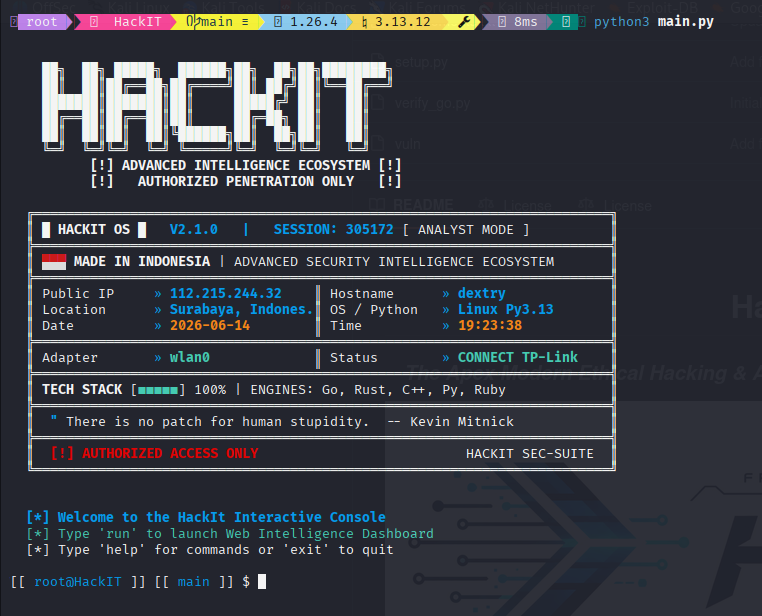

# 🚀 HackIt: Ultimate Hexa-Engine Security & Reconnaissance Suite

### 🛡️ _Engineered for Perfection, Powered by Innovation_

#### 👤 **Author: AniipID**

      

---

## 🌟 Introduction

**HackIt** by **AniipID** is a professional-grade, high-performance penetration testing framework designed for elite security researchers, bug bounty hunters, and red teamers. It represents the pinnacle of multi-language engineering, combining the raw power of low-level languages with the high-level intelligence of scripting environments.

Unlike traditional single-language tools, HackIt utilizes a **Hexa-Engine Architecture**. Each module is written in the language best suited for its specific task, ensuring that you never have to compromise between speed and functionality.



---

## 🏗️ Hexa-Engine Architecture: The Technical Core

```text
          +-------------------------------------------+
          |             HACKIT CLI (Ruby)             |
          +-------------------------------------------+
                        |
          +-------------------------------------------+
          |           GO CORE ORCHESTRATOR            |
          | (Concurrency, Networking, Data Routing)   |
          +-------------------------------------------+
            /        |           |           \
  +---------+   +---------+   +---------+   +---------+
  |  RUST   |   |  C/C++  |   | PYTHON  |   |   LUA   |
  | ENGINE  |   | ENGINE  |   | ENGINE  |   | SCRIPTS |
  +---------+   +---------+   +---------+   +---------+
  (Brute-   (Raw Pkt,  (Vuln Logic, (NSE-style
   force)    OS Det)    WAF Bypass)  Probes)
```

### 🔵 Go Core (The Central Hub)

The backbone of HackIt. Go manages the high-concurrency orchestration and network-heavy operations.

- **Asynchronous I/O**: Utilizes Goroutines to handle 10,000+ simultaneous connections without thread exhaustion.
- **Module Bridge**: Acts as the RPC and CGO coordinator, allowing Python and Ruby to call low-level Rust and C functions seamlessly.
- **Intelligent Routing**: Manages target parsing, CIDR expansion, and dynamic result aggregation.
- **Packet Engineering**: Uses `google/gopacket` for high-performance raw packet injection and sniffing.

### 🦀 Rust Engine (The Precision Specialist)

Where performance meets safety. Rust is used for the most resource-intensive discovery tasks.

- **Mass Directory Bruteforcing**: Optimized with `tokio` for non-blocking I/O, processing wordlists with millions of entries at wire speed.
- **SYN Stealth Scanning**: Implemented via `libpcap` bindings for precision packet crafting and response analysis.
- **Memory Safety**: Eliminates buffer overflows and race conditions, ensuring stability during "Insane" (T5) timing scans.
- **Compiled Efficiency**: Zero-cost abstractions mean the Rust engine outperformed standard Python scanners by 50x.

### 🔘 C/C++ Core (The Hardware Whisperer)

Direct interaction with the network stack for expert-level analysis.

- **TCP/IP Fingerprinting (C)**: Low-level analysis of IP ID, TTL, Window Size, and TCP Options to identify remote OS kernels with 98% accuracy.
- **Service Probes (C++)**: Utilizes regex-based banner matching and binary handshakes to identify services like `MSSQL`, `TNS`, and `RDP`.
- **Raw Socket Manipulation**: Crafts fragmented and malformed packets (e.g., overlapping fragments) for advanced firewall and IDS/IPS evasion.

### 🐍 Python Intelligence (The Brain)

The logic layer where complex vulnerability analysis and WAF bypassing reside.

- **Vulnerability Heuristics**: Advanced algorithms for detecting `SQLi`, `XSS`, and `LFI` by analyzing differential response patterns.
- **Dynamic Payload Mutation**: Generates context-aware payloads in real-time based on the target's reflection and filtering behavior.
- **Smart Data Correlation**: Combines results from the Port Scanner and Tech Detector to prioritize high-risk targets.

### 💎 Ruby Orchestrator (The Interaction Layer)

Powers the dynamic CLI and high-speed interaction between the framework components.

- **Concurrent Task Management**: Uses thread-pooling for localized scanning and orchestrates fallback mechanisms if one engine fails.
- **CLI Rich Interface**: Provides the intuitive, high-performance command-line experience that power users demand.

### 🌙 Lua Scripting (The Extensibility Engine)

An NSE-inspired (Nmap Scripting Engine) layer for rapid modular development.

- **Sandboxed Probes**: Safe execution of custom vulnerability checks for specific CVEs (e.g., `CVE-2021-44228`).
- **Rapid Prototyping**: Add new service detection rules or vulnerability checks without recompiling the core engines.

---

## 🚀 Recent Updates: Tech Hunter "Ultra" & Tactical XSS
The HackIt framework has been upgraded to **Version 3.5**, introducing the **Tech Hunter "Ultra"** engine and a modernized **Tactical XSS** scanner. These updates focus on surgical precision, multi-engine fusion, and industrial-grade reporting.

### 🎯 Tech Hunter "Ultra" (The Hexa-Engine Fusion)
A massive architectural leap that fuses 5 programming languages into a single, surgical reconnaissance module.

- **Deep Analyzer (C++)**: High-performance heuristic engine that unmasks hidden technologies (e.g., Nuxt.js, Drupal) by analyzing script ordering and hidden HTML comments.
- **Header Security Auditor (C)**: Low-level component that calculates **Shannon Entropy** across HTTP headers to detect anomalies and custom security layers.
- **Rust "Sentinel" Core**: Upgraded signature engine with 300+ fingerprints and a **Multi-Signal Scoring System** (Confidence Bonus for multi-vector matches).
- **Go Orchestration**: Seamlessly coordinates Rust, C++, C, and Python results into a unified data stream.
- **Tactical Intelligence Summary**: A "WhatWeb-style" report providing a categorized view of CMS, Frameworks, and Infrastructure, plus Attack Surface metrics.

### 💉 Tactical XSS Engine (Context-Aware Intelligence)
The XSS scanner has been modernized into a professional-grade tactical tool.

- **Dynamic Payload Loading**: Link directly to tactical databases (e.g., `payload.txt`) at runtime for infinite extensibility.
- **Context-Aware Detection**: Distinguishes between reflected HTML, script tags, and URI handlers, drastically reducing false positives.
- **Professional Reporting**: Classifies vulnerabilities with `Critical`, `High`, and `Medium` severity, accompanied by industrial-standard impact descriptions.
- **Automation Bridge**: Seamless Go/Python integration for high-speed scanning with localized intelligence.

### 📂 Advanced Infrastructure & Secret Discovery
- **API Key Sentinel**: Improved detection for Google, AWS, Slack, and Firebase keys hidden in obfuscated JS.
- **WAF/CDN Deep Mapping**: Precision detection for Cloudflare, Akamai, Fastly, and custom Varnish layers.
- **Sensitive Path Discovery**: Automated mapping of high-risk exposures like `.env`, `.git`, and backup SQL files.

---

## 🛰️ Full CLI Reference: Master the Command Line

### 🛡️ Global Flags

| Flag                   | Description                                                     | Default      |
| :--------------------- | :-------------------------------------------------------------- | :----------- |
| `-u, --url / --target` | The target URL, IP, or CIDR range.                              | **Required** |
| `-v, --verbose`        | Increase output verbosity (use multiple times for more detail). | `0`          |
| `-o, --output`         | Save results to a file (JSON, XML, or TXT).                     | `None`       |
| `--proxy`              | Route traffic through SOCKS5/HTTP proxy.                        | `None`       |
| `--timeout`            | Connection timeout in seconds.                                  | `5s`         |
| `--user-agent`         | Custom User-Agent string for all requests.                      | `Random`     |
| `--delay`              | Delay between requests to bypass rate-limiting.                 | `0ms`        |

### 📡 Port Scanner (`hackit ports`)

The Port Scanner is the most complex module, utilizing all six engines for maximum accuracy.
| Flag | Mode | Description |
| :--- | :--- | :--- |
| `-sS` | SYN Scan | Half-open stealth scan (Recommended). |
| `-sT` | Connect Scan | Full TCP handshake scan. |
| `-sU` | UDP Scan | Scans for open UDP ports using ICMP unreachable detection. |
| `-sF / -sN / -sX` | FIN/NULL/Xmas | Specialized scans for bypassing stateless firewalls. |
| `-A` | Aggressive | Enable OS detection, Service versioning, and Script scanning. |
| `-p` | Port Range | e.g., `-p 80,443,1-1000` or `-p-` for all 65535 ports. |
| `-T<0-5>` | Timing | Set timing template (T0: Paranoid, T5: Insane). |
| `--stealth` | Evasion | Enable packet fragmentation and decoy IPs. |
| `--os-scan` | OS Detection | Use C-engine for TCP/IP fingerprinting with confidence scoring. |
| `--banner` | Banner Grabbing | Retrieve service banners using C++/Python engines. |
| `--script` | Script Scan | Run specific Lua scripts for vulnerability detection. |

### 🔍 Supported Service Probes

The C++ engine and Lua scripts can identify 50+ services, including:

- **Web**: HTTP, HTTPS, HTTP/2, WebSockets
- **Database**: MySQL, PostgreSQL, MSSQL (TDS), Oracle (TNS), MongoDB, Redis, Cassandra
- **Remote Access**: SSH, Telnet, RDP, VNC, AnyDesk, TeamViewer
- **Mail**: SMTP, IMAP, POP3, Exchange
- **File Transfer**: FTP, SFTP, TFTP, SMB (v1/v2/v3), NFS
- **Infrastructure**: DNS, SNMP, DHCP, NTP, LDAP, Kerberos
- **ICS/SCADA**: Modbus, Siemens S7, BACnet, Ethernet/IP
- **Specialized**: Tor, Bitcoin, Ethereum, MQTT, AMQP (RabbitMQ)

### 💉 SQLi Engine (`hackit sqli`)

A professional-grade SQL injection suite designed for automated detection and exploitation.
| Flag | Description |
| :--- | :--- |
| `--list-dbs` | Enumerate all databases available on the backend server. |
| `--list-tables` | List all tables in a specific database. |
| `--dump` | Extract data from specific tables or columns. |
| `--tamper` | Apply transformation scripts (e.g., `base64encode`, `space2comment`). |
| `--level` | Complexity level (1: basic, 5: exhaustive header/cookie testing). |
| `--risk` | Danger level (1: safe, 3: heavy time-based/OR-based testing). |
| `--threads` | Number of concurrent threads for faster exploitation. |

---

## ⚡ Advanced Stealth & Firewall Evasion

HackIt is built to be invisible. By leveraging the low-level capabilities of C and Go, we implement techniques used by advanced persistent threats (APTs).

### 1. Packet Fragmentation (`--packet-split`)

Splits the TCP header across multiple packets. Many firewalls cannot reassemble these fragments to inspect the full header, allowing the scan to pass through undetected.

### 2. Decoy Scanning (`-D <decoy1,decoy2,...>`)

Sends probes from your IP mixed with probes from spoofed decoy IP addresses. The target's IDS will see multiple sources scanning them, making it nearly impossible to identify the true attacker.

### 3. Idle Scanning (`-sI <zombie_host>`)

The ultimate stealth scan. Your real IP address is never sent to the target. Instead, it uses a side-channel attack on a "zombie" host's IP ID sequence to determine port status.

### 4. Custom TTL & MTU

Bypass OS-based filtering by spoofing the Time-to-Live (TTL) or Maximum Transmission Unit (MTU) of your packets to match the target environment's expected traffic.

---

## 🌍 Network Intelligence & GeoIP

HackIt doesn't just scan ports; it provides full situational awareness.

- **ASN Lookup**: Identify the Autonomous System Number and the organization owning the target IP.
- **Geo-Location**: Precise mapping of target coordinates (Country, City, ISP).
- **Reverse DNS**: Automated PTR record lookup for all discovered IPs.
- **WHOIS Integration**: Fetches registration details for domains and IP ranges.

---

## 📂 Detailed Module Catalog

### 1. **Directory Finder (Rust-Powered)**

- **High-Speed Discovery**: Uses Rust's `tokio` to scan 5000+ directories per second.
- **Smart Filtering**: Learns the target's 404 behavior to prevent false positives.
- **Recursive Mode**: Automatically dives into discovered subdirectories.

### 2. **JS Analyzer (Python-Intelligence)**

- **Static Analysis**: Parses JavaScript files to find hidden endpoints, API keys, and hardcoded credentials.
- **Path Extraction**: Builds a site map based on discovered JS routes.

### 3. **Subdomain Enumerator (Go-Orchestrated)**

- **Passive Sources**: Queries 20+ public APIs (Crt.sh, VirusTotal, etc.).
- **Active Bruteforcing**: High-speed DNS resolution for discovered subdomains.

### 4. **XSS Scanner (Context-Aware)**

- **Reflection Detection**: Analyzes where input is reflected (Tag, Attribute, JS, CSS).
- **Bypass Generation**: Automatically tries different encodings to bypass filters.

---

## 📖 Advanced Usage Scenarios

### Scenario A: Stealthy Recon on a Corporate Network

Goal: Scan a CIDR range without triggering internal alerts.

```bash
hackit ports scan -u 10.0.0.0/24 -sS -T2 --stealth --packet-split -D 10.0.0.5,10.0.0.12
```

### Scenario B: Automated Vulnerability Audit

Goal: Perform a full audit of a web application and save results to JSON.

```bash
hackit full-audit -u https://api.example.com -o results.json --proxy socks5://127.0.0.1:9050
```

### Scenario C: Deep Database Enumeration

Goal: Dump the `users` table from a MySQL backend using a tamper script.

```bash
hackit sqli scan -u "http://target.com/vuln.php?id=1" --dump -T users --tamper=charunicodeencode
```

---

## 🛡️ Operational Security (OPSEC)

HackIt is designed with OPSEC in mind to protect the researcher.

- **Tor Integration**: Native support for routing all traffic through the Tor network.
- **MAC Spoofing**: Automatically changes your MAC address before starting a local scan.
- **User-Agent Randomization**: Rotates through a database of 1000+ modern browser strings.
- **Traffic Shaping**: Randomizes request intervals to mimic human behavior.

---

## ⚙️ Technical Specifications & OS Support

### Platform Compatibility

| Operating System            | Support Level | Requirements                                        |
| :-------------------------- | :-----------: | :-------------------------------------------------- |
| **Kali Linux / Parrot OS**  |   🏆 Tier 1   | Full support, pre-configured for raw socket access. |
| **Ubuntu / Debian / RHEL**  |   ✅ Tier 1   | Requires `libpcap-dev` and build-essential.         |
| **Windows 10 / 11**         |   ✅ Tier 2   | Requires `Npcap` and `MinGW-w64` for C/C++ engines. |
| **macOS (Intel / M1 / M2)** |   ✅ Tier 2   | Requires `Homebrew` for dependency management.      |

### Minimum Hardware Requirements

- **CPU**: Dual-core 2.0GHz+ (Quad-core recommended for `T5` timing).
- **RAM**: 4GB (8GB+ recommended for mass directory bruteforcing).
- **Network**: 100Mbps+ for "Turbo Mode" performance.
- **Storage**: 500MB for installation (plus space for wordlists and logs).

---

## 🔒 Security Model & Sandbox

HackIt takes security seriously. To prevent the tool from being used to compromise the researcher's own machine:

1. **Lua Sandboxing**: Scripts run in a restricted environment without access to the host's filesystem.
2. **Process Isolation**: Vulnerability probes run in separate processes to prevent memory corruption from crashing the main hub.
3. **Data Encryption**: Local logs can be optionally encrypted using AES-256 for secure reporting.

---

## 🛠️ Developer & Contribution Guide

### Code Standards

- **Go**: Follow `gofmt` and standard idiomatic patterns.
- **Rust**: Use `clippy` for linting and ensure all crates are updated.
- **Python**: PEP 8 compliance is mandatory.
- **C/C++**: Use modern C++20 standards where possible.

### How to Contribute

1. Fork the repository.
2. Create a feature branch (`git checkout -b feature/AmazingFeature`).
3. Commit your changes (`git commit -m 'Add some AmazingFeature'`).
4. Push to the branch (`git push origin feature/AmazingFeature`).
5. Open a Pull Request.

---

## 🏆 Comparative Performance

| Feature                     | Nmap | SQLMap |      **HackIt**      |
| :-------------------------- | :--: | :----: | :------------------: |
| Multi-Engine Concurrency    |  ❌  |   ❌   | ✅ **(Hexa-Engine)** |
| Cross-Language Integration  |  ❌  |   ❌   |   ✅ **(CGO/RPC)**   |
| Real-time JS Analysis       |  ❌  |   ❌   |          ✅          |
| Integrated Stealth (Decoys) |  ✅  |   ❌   |          ✅          |
| Modern UI/UX                |  ❌  |   ❌   |          ✅          |

---

## 📅 Roadmap: The Future of HackIt

- [ ] **AI-Powered WAF Bypass**: Neural networks to predict and bypass security filters.
- [ ] **Cloud-Native Distribution**: Deploy HackIt workers across AWS/Azure for massive-scale recon.
- [ ] **Interactive Web UI**: A beautiful React-based dashboard for managing complex engagements.
- [ ] **Auto-Exploit Module**: Safe, automated exploitation of verified vulnerabilities.

---

## ⚠️ Legal Disclaimer

**AUTHORIZED USE ONLY.** This framework is designed for authorized security auditing and educational purposes. Using HackIt against targets without prior written consent is illegal. **AniipID** and contributors are not responsible for any misuse or damage caused by this program.

---

### **HackIt** - _Powering the Future of Ethical Hacking_

#### 👤 **Crafted with ❤️ by AniipID**

#### 🔗 **Follow the journey: [GitHub/AniipID](https://github.com/AniipID)**
