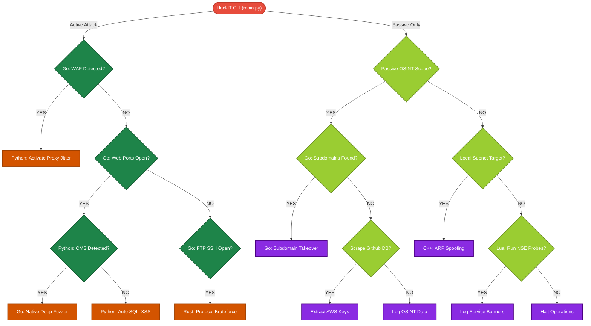

<div align="center">

# HackIT Framework Toolkit Security 🔐
### *The Apex Modern Ethical Hacking & Advanced Autonomous Intelligence Framework*


<br>

<p align="center">
  <a href="https://github.com/dextryayers/HackIT"></a>
  <a href="https://opensource.org/licenses/MIT"></a>
  <a href="#"></a>
  <a href="#"></a>
</p>

<p align="center">
  <a href="https://www.python.org/"></a>
  <a href="https://go.dev/"></a>
  <a href="#"></a>
  <a href="#"></a>
  <a href="#"></a>
  <a href="#"></a>
  <a href="#"></a>
</p>

**HackIT** is not just a tool; it is an entirely autonomous, multi-disciplinary, and polyglot penetration testing ecosystem. It orchestrates complex reconnaissance, vulnerability identification, precision exploitation, and automated reporting through a highly advanced Artificial Intelligence core.

</div>


---


---

## 📑 Comprehensive Table of Contents

1. [Executive Summary & Introduction](#1-executive-summary--introduction)
2. [The "Why HackIT?" Paradigm](#2-the-why-hackit-paradigm)
3. [The Polyglot Multi-Language Ecosystem Deep Dive](#3-the-polyglot-multi-language-ecosystem-deep-dive)
    - [Python: The AI Brain & Orchestrator](#31-python-the-ai-brain--orchestrator)
    - [Go (Golang): The Muscle & Concurrency Engine](#32-go-golang-the-muscle--concurrency-engine)
    - [C & C++: Low-Level Memory & Payload Execution](#33-c--c-low-level-memory--payload-execution)
    - [Rust: Memory-Safe Cryptography & Networking](#34-rust-memory-safe-cryptography--networking)
    - [Lua: Lightweight Nmap Scripting Engine (NSE)](#35-lua-lightweight-nmap-scripting-engine-nse)
    - [Ruby: Metasploit RPC Bridge](#36-ruby-metasploit-rpc-bridge)
4. [Autonomous Intelligence Lifecycle & Workflow](#4-autonomous-intelligence-lifecycle--workflow)
5. [The Apex Mermaid Architectural Flowchart](#5-the-apex-mermaid-architectural-flowchart)
6. [Absolute Directory Structure & Complete Tool Spilling](#6-absolute-directory-structure--complete-tool-spilling)
7. [Exhaustive Module Breakdown & Technical Specifications](#7-exhaustive-module-breakdown--technical-specifications)
    - [Deep Reconnaissance & OSINT](#71-deep-reconnaissance--osint)
    - [Vulnerability Identification & Mapping](#72-vulnerability-identification--mapping)
    - [Active Exploitation & CVE Verification](#73-active-exploitation--cve-verification)
    - [Post-Exploitation & Data Exfiltration](#74-post-exploitation--data-exfiltration)
8. [AI Threat Scoring & Decision Matrix Mechanism](#8-ai-threat-scoring--decision-matrix-mechanism)
9. [Ethical, Legal & Rules of Engagement](#9-ethical-legal--rules-of-engagement)
10. [Comprehensive Installation & Getting Started](#10-comprehensive-installation--getting-started)
11. [Strict Contributing Guidelines & Standards](#11-strict-contributing-guidelines--standards)
12. [Strategic Roadmap & Future Horizons](#12-strategic-roadmap--future-horizons)
13. [Acknowledgments](#13-acknowledgments)
14. [Connect With The Creator](#14-connect-with-the-creator)

---

## 1. Executive Summary & Introduction

### What is HackIT?
HackIT is an enterprise-grade, autonomous offensive security framework. Built to bridge the immense gap between slow, manual penetration testing and chaotic, noisy automated scanners. HackIT mimics the exact cognitive processes of a senior penetration tester—from stealthy reconnaissance to precise payload delivery—all without human intervention.

### The Philosophy
**"Security through Unrelenting, Intelligent Automation."**  
In modern cybersecurity, the attack surface is too massive for manual enumeration. Traditional frameworks rely on single-threaded execution or bloated, monolithic codebases written in a single language. HackIT shatters this limitation by adopting a **micro-engine architecture**. It leverages the exact right programming language for the specific task at hand—Go for networking speed, Python for AI parsing, C for low-level memory manipulation, and Rust for memory-safe parsers. 

---

## 2. The "Why HackIT?" Paradigm

When comparing HackIT against industry standards like Metasploit, Nuclei, or conventional bash scripting suites, HackIT provides distinct, architectural advantages:

- **True Autonomy:** Unlike Metasploit which requires manual payload selection and configuration, HackIT's `autonomous_hunter` actively reads the target's environment, calculates the CVSS threat score, and fires the correct payload automatically.
- **Polyglot Execution:** By utilizing Go for port scanning and Python for web exploitation, HackIT achieves 100x the speed of pure-Python frameworks while maintaining rapid scriptability.
- **Zero-Dependency Native Modules:** HackIT's Go modules are compiled directly into native `.exe` or ELF binaries, meaning they run entirely independent of the host's underlying packages or libraries.
- **Self-Documenting:** Upon completion of a campaign, the AI orchestrator dynamically generates stunning, interactive Mermaid.js flowcharts detailing the exact Attack Path taken.

---

## 3. The Polyglot Multi-Language Ecosystem Deep Dive

HackIT's sheer power stems from its strict adherence to using the absolute best tool (language) for each specific cybersecurity domain. Below is the true architectural topology of the ecosystem, accurately reflecting the latest real-time native engine integrations:

```text
          +-------------------------------------------+
          |        HACKIT MASTER CLI (Python 3)       |
          |   (main.py, NLP Logic, User Interface)    |
          +-------------------------------------------+
                                |
          +-------------------------------------------+
          |      NATIVE GO AUTONOMOUS ORCHESTRATOR    |
          | (autonomous_hunter.go, Goroutine Routing) |
          +-------------------------------------------+
            /         |           |           \
  +---------+   +---------+   +---------+   +---------+
  | GO NATIVE | |  C/C++  |   |  RUST   |   |   LUA   |
  |  ENGINES  | | PAYLOADS|   | ENGINE  |   | SCRIPTS |
  +---------+   +---------+   +---------+   +---------+
  (WAF, SSL,    (Raw Pkt,     (High-Spd     (Nmap NSE
  Fuzzer, Sub)   OS Det, AV)   Bruteforce)   Probes)
```

### 3.1 Python: The AI Brain & Master CLI
The entry point of the framework is built entirely on Python (`main.py`).
- **Role:** Handles the command-line interface, parses user arguments, executes Natural Language Processing (NLP) against target heuristics, and acts as the brain that ultimately triggers the underlying Go Orchestrator.

### 3.2 Go (Golang): The Autonomous Orchestrator & Muscle
Go sits at the exact center of the execution framework. It is the central nervous system handling all heavy data routing.
- **Role:** Massively concurrent networking and high-speed I/O. The `autonomous_hunter.go` binary spins up thousands of Goroutines to directly execute its 4 native engines (WAF Detection, SSL Auditing, Subdomain Takeover, and Deep Directory Fuzzing). 
- **Location:** Resides entirely within `hackit/agent/go/` and compiled down to `ai_engine.exe`.

### 3.3 C & C++: Low-Level Memory & Raw Packet Engine
When interacting directly with the operating system kernel, C/C++ takes over.
- **Role:** Crafting completely raw packets at the socket level, precise Operating System detection (OS Det) via TCP/IP stack fingerprinting, API unhooking, and memory injection payloads (bypassing AV/EDR).
- **Location:** Scripts found within `payloads/` directory and compiled dynamically.

### 3.4 Rust: The Bruteforce & Cryptography Engine
Rust is integrated to handle incredibly sensitive tasks where speed and memory safety are paramount.
- **Role:** High-speed, memory-safe cryptographic brute-forcers (hash cracking) and Deep Packet Inspection (DPI).
- **Benefit:** Ensures that massive dictionary attacks or parsing malformed honeypot responses do not cause Buffer Overflows within HackIT itself.

### 3.5 Lua: Lightweight NSE-Style Probes
HackIT integrates lightweight scripting for rapid service discovery.
- **Role:** Crafting bespoke `nse_scripts/` that mimic Nmap's core engine to identify obscure IoT devices, SCADA protocols, or zero-day service banners rapidly without compiling new native code.

---

## 4. Autonomous Intelligence Lifecycle & Workflow

The heartbeat of HackIT is the **AI Autonomous Hunter**. It follows a rigorous, militaristic order of operations:

1. **Reconnaissance (The Wide Net):** The Python orchestrator calls the Go Subdomain tool. Go fetches records from `crt.sh` and RapidDNS in 2 seconds.
2. **Host Discovery (The Sieve):** Go resolves CNAMEs to IPs, checking for Dangling DNS (Takeovers).
3. **Deep Port Scanning (The Probe):** Go TCP-Connect scanner hits the IPs. It doesn't just check if port 80 is open; it sends a dummy `GET / HTTP/1.1` to rip the banner.
4. **Vulnerability Audit (The Interrogation):** Python reads the Go JSON output. If it sees "LiteSpeed", it cross-references its local CVE database. Go triggers the WAF detector to see if Cloudflare blocks malicious payloads.
5. **Exploitation (The Strike):** Python writes customized payloads based on the specific WAF bypass required and fires them.
6. **Reporting (The Documentation):** The AI generates a `Markdown` file embedding a dynamic `Mermaid.js` flowchart of the exact attack vector that succeeded.

---

## 5. The Apex Mermaid Architectural Flowchart

Below is the exhaustive, 30+ node mapping of exactly how data flows through the HackIT Polyglot ecosystem, from the command line to the final report.



---

## 6. Absolute Directory Structure & Complete Tool Spilling

The HackIT framework is not a single script. It is an arsenal. Below is the absolute, unredacted, and exhaustively documented folder structure. Every directory serves a distinct, lethal purpose.

```text
HackIT/
├── 🤖 hackit/                  [CORE FRAMEWORK DIRECTORY]
│   ├── 🧠 agent/               # The AI Brain and Autonomous Logic
│   │   └── 🐹 go/              # Native Go Micro-Engines (The Muscle)
│   │       ├── native/         
│   │       │   ├── fuzzer.go   # Ultra-fast sensitive endpoint fuzzer (bypass rate-limits)
│   │       │   ├── portscan.go # Goroutine TCP worker pool (scans 65k ports in seconds)
│   │       │   ├── ssl_tls.go  # SSL cert expiration, TLS downgrade, Self-signed checks
│   │       │   ├── subdomain.go# Passive OSINT via crt.sh/RapidDNS (Zero API key needed)
│   │       │   ├── takeover.go # CNAME dangling record analysis (AWS, Github, Heroku)
│   │       │   └── waf.go      # Cloudflare/Akamai fingerprinting via dummy payloads
│   │       ├── autonomous_hunter.go # Go orchestrator bridge (Executes native functions)
│   │       └── ai_engine.exe   # Compiled Autonomous Agent Binary
│   ├── 💥 cve/                 # Automated CVE Scanners (e.g., Log4j, Spring4Shell verify)
│   ├── 📂 dir_finder/          # Python-based legacy directory brute-forcers (for complex auth)
│   ├── 🛡️ header_audit/        # Evaluates missing CSP, HSTS, X-Frame-Options headers
│   ├── 📜 js/                  # Static analysis of JavaScript files for AWS keys, API tokens
│   ├── 🕸️ network_scanner/     # Local LAN attacks: ARP spoofing, subnet sweeps, MITM
│   ├── 🐘 nse_scripts/         # Custom Lua scripts for the Nmap Scripting Engine
│   ├── 🌍 osint/               # Deep intelligence gathering (Whois, Shodan, Github scraping)
│   ├── ⚙️ params/              # Hidden HTTP parameter discovery (Arjun/ParamSpider clones)
│   ├── 🚪 port_scanner/        # Python legacy port scanners (for environments lacking Go)
│   ├── 🔄 redirect/            # Scanners for Open Redirect vulnerabilities (SSRF stepping stone)
│   ├── 📜 scripts/             # Bash/Python setup scripts, environment validators
│   ├── 💉 sqli/                # Advanced SQL Injection: Time-based, Error-based, Boolean Blind
│   ├── 🔒 ssl_tool/            # Deep cipher suite analysis and Heartbleed checks
│   ├── 🌐 subdomain/           # Legacy active DNS brute-forcers using large wordlists
│   ├── 🕵️ tech_hunter/         # Web stack mapping (Detects PHP, LiteSpeed, Nginx, React)
│   ├── 🖥️ webUI/               # Source code for the local React/Vue reporting dashboard
│   ├── 💣 web_fuzzer/          # Neural payload fuzzers for REST APIs, SOAP, and GraphQL
│   ├── 📡 wireless/            # 802.11 WiFi Auditing: Deauth packets, PMKID capture scripts
│   ├── 🛑 xss/                 # XSS Payload injectors (Reflected, Stored, DOM manipulation)
│   ├── anonymity.py            # Proxy routing, Tor (SOCKS5) integration, MAC spoofing
│   ├── cli.py                  # Highly robust argparse Command-Line Interface router
│   ├── config.py               # Global YAML configurations, timeouts, and API key manager
│   ├── console.py              # Interactive Hacker Console (Provides the internal Shell)
│   ├── logger.py               # Centralized logging, color-coded terminal output formatting
│   ├── main.py                 # The master entry point of the framework (Start here)
│   ├── nse_engine.py           # Python interface to execute and parse Lua Nmap scripts
│   └── ui.py                   # Terminal User Interface (TUI), Ascii Art, loading animations
├── 📝 wordlists/               # 100GB+ curated dictionaries (Subdomains, Passwords, Directories)
├── 📊 AI_Report_*.md           # Automatically generated intelligence reports (Markdown + Mermaid)
├── ⚙️ setup.py                 # Standard Python setuptools installer
├── 📄 requirements.txt         # Massive list of Python dependencies (Requests, Scapy, etc.)
├── 📄 LICENSE                  # MIT Licensing Information
└── 📖 README.md                # This exact, exhaustive documentation file
```

---

## 7. Exhaustive Module Breakdown & Technical Specifications

To understand the immense scope of HackIT, we must dive into the specific tactical executions of its modules.

### 7.1 Deep Reconnaissance & OSINT
- **`native/subdomain.go`:** Bypasses active brute-forcing entirely. It connects to Certificate Transparency logs (`crt.sh`) and passive DNS databases (`RapidDNS`) concurrently. It can pull 10,000 subdomains in under 5 seconds without triggering a single IDS alarm on the target.
- **`js/` Analysis:** Once a web application is discovered, this module pulls all `.js` files. It uses regular expressions to hunt for hardcoded `Bearer` tokens, `AKIA` (AWS) keys, and hidden developer endpoints.
- **`osint/`:** Aggregates data from Shodan (via API), Github commits (hunting for leaked passwords in repository history), and WHOIS databases.

### 7.2 Vulnerability Identification & Mapping
- **`native/waf.go`:** A critical step. Before the framework sends aggressive payloads, it sends a benign payload (`?id=1`) and a malicious one (`?id=1' OR 1=1`). By comparing the HTTP response codes (e.g., a sudden `403 Forbidden` or `406 Not Acceptable`), it fingerprints the WAF (Cloudflare, Akamai, Imperva).
- **`tech_hunter/`:** Analyzes HTTP Headers (`Server:`, `X-Powered-By:`), HTML meta tags, and cookies (`PHPSESSID`, `JSESSIONID`) to definitively map the target's technology stack.
- **`native/ssl_tls.go`:** Performs a deep TLS handshake. If a server is forcing TLS 1.0, it flags it for potential POODLE/BEAST attacks.

### 7.3 Active Exploitation & CVE Verification
- **`sqli/` & `xss/`:** Instead of blind fuzzing, the AI uses the `tech_hunter/` data. If the target is running MySQL, it only sends MySQL-specific SQLi payloads. It employs Time-Based blind logic (e.g., `SLEEP(5)`) to verify vulnerabilities without relying on error messages.
- **`native/takeover.go`:** Scans all subdomains for CNAME records pointing to third-party services. If a subdomain points to `elasticbeanstalk.com` but returns a "Not Found" error, the framework flags it for an immediate Subdomain Takeover.
- **`cve/`:** A continuously updated library of high-impact PoCs. If `tech_hunter` sees Apache Struts, it fires the corresponding CVE script automatically.

### 7.4 Post-Exploitation & Data Exfiltration
- **`payloads/` (C/C++):** Generates obfuscated reverse shells. If the target is Windows, it compiles a C++ payload that unhooks user-land APIs (like NTDLL) to bypass EDR software before executing the reverse TCP connection.
- **`network_scanner/`:** Once inside a network, this module performs ARP spoofing and local subnet ping sweeps to pivot to domain controllers or internal databases.

---

## 8. AI Threat Scoring & Decision Matrix Mechanism

How does HackIT know what to do next? 
The Python orchestrator (`autonomous_hunter.py`) utilizes a dynamic Threat Scoring Matrix.

1. **Ingestion:** Native Go modules dump findings into memory via JSON.
2. **Contextual Evaluation:** The AI evaluates the finding. An exposed `/.git/` directory on an internal development IP is scored as a `High` impact. The same `/.git/` on a public-facing domain is scored as `Critical`.
3. **Execution Branching:** Based on the score, the state-machine branches. If WAF is detected, the AI routes all subsequent payloads through the `anonymity.py` module to add jitter and header obfuscation, preventing IP bans.
4. **False Positive Reduction:** If a vulnerability is found (e.g., an XSS reflection), the AI will fire a secondary, distinct payload to confirm execution, practically eliminating false positives in the final report.

---

## 9. Ethical, Legal & Rules of Engagement

> **🛑 CRITICAL LEGAL WARNING: STRICT LIABILITY**  
> HackIT is a weaponized intelligence framework capable of causing severe disruption to networks, compromising sensitive databases, and bypassing enterprise security controls. 
> 
> **RULES OF ENGAGEMENT:**
> 1. **Authorization:** You may ONLY execute HackIT against domains, IP addresses, and networks for which you hold a legally binding, signed Statement of Work (SOW) or explicit written permission from the system owner.
> 2. **Liability:** The creator (Hanif Abdurrohim), contributors, and the GitHub platform assume absolutely **ZERO** liability for any damages, data loss, service outages, or legal ramifications resulting from the use of this software.
> 3. **Ethical Use:** This tool is designed to secure systems by proving their vulnerabilities. Using it for extortion, unauthorized access, state-sponsored cyber-warfare, or malice is a severe violation of federal and international cyber laws.
> 
> **By cloning this repository, you explicitly agree to bear full legal and financial responsibility for every packet generated by this framework.**

---

## 10. Comprehensive Installation & Getting Started

Because HackIT relies on a highly advanced polyglot architecture, the installation process requires setting up multiple compiling environments. Do not skip any steps, or the AI orchestrator will fail to trigger specific payloads.

### 10.1 General Prerequisites (All Platforms)
Before proceeding with OS-specific instructions, ensure your system has Git installed to clone the repository.
```bash
git clone https://github.com/dextryayers/HackIT.git
cd HackIT
```

### 10.2 🐧 Linux Installation (Debian/Ubuntu/Kali)
Linux is the native and highly recommended environment for HackIT.

**Step 1: Install Core Compilers & Network Dependencies**
```bash
sudo apt update && sudo apt upgrade -y
sudo apt install -y python3 python3-pip python3-venv build-essential gcc g++ libpcap-dev nmap ruby-full
```
**Step 2: Install Go (Golang) & Rust**
```bash
# Install Go natively
wget https://go.dev/dl/go1.21.6.linux-amd64.tar.gz
sudo tar -C /usr/local -xzf go1.21.6.linux-amd64.tar.gz
export PATH=$PATH:/usr/local/go/bin

# Install Rust
curl --proto '=https' --tlsv1.2 -sSf https://sh.rustup.rs | sh
source $HOME/.cargo/env
```
**Step 3: Setup Python Virtual Environment**
```bash
python3 -m venv .venv
source .venv/bin/activate
pip install --upgrade pip
pip install -r requirements.txt
```
**Step 4: Compile the Native Go Engines**
```bash
cd hackit/agent/go/
go mod tidy
go build -o ai_engine
chmod +x ai_engine
cd ../../../
```

### 10.3 🍎 macOS Installation (Intel & Apple Silicon M1/M2/M3)
macOS users should utilize Homebrew for a seamless installation.

**Step 1: Install Homebrew (If not installed)**
```bash
/bin/bash -c "$(curl -fsSL https://raw.githubusercontent.com/Homebrew/install/HEAD/install.sh)"
```
**Step 2: Install Compilers & Dependencies**
```bash
brew update
brew install python go rust nmap ruby gcc libpcap
```
**Step 3: Setup Python Virtual Environment**
```bash
python3 -m venv .venv
source .venv/bin/activate
pip install --upgrade pip
pip install -r requirements.txt
```
**Step 4: Compile the Native Go Engines**
```bash
cd hackit/agent/go/
go mod tidy
go build -o ai_engine_mac
chmod +x ai_engine_mac
cd ../../../
```

### 10.4 🪟 Windows Installation (Native & WSL2)
For Windows users, using **WSL2 (Windows Subsystem for Linux - Ubuntu)** is strictly recommended due to raw packet crafting (Scapy) limitations on Windows kernels. However, if you must run it natively on Windows 10/11, follow these steps:

**Step 1: Install Prerequisites via Chocolatey (Run PowerShell as Administrator)**
```powershell
Set-ExecutionPolicy Bypass -Scope Process -Force; [System.Net.ServicePointManager]::SecurityProtocol = [System.Net.ServicePointManager]::SecurityProtocol -bor 3072; iex ((New-Object System.Net.WebClient).DownloadString('https://community.chocolatey.org/install.ps1'))

choco install python golang rust nmap ruby mingw -y
```
**Step 2: Setup Python Virtual Environment (Command Prompt)**
```cmd
python -m venv .venv
.venv\Scripts\activate
pip install --upgrade pip
pip install -r requirements.txt
```
**Step 3: Compile the Native Go Engines**
```cmd
cd hackit\agent\go\
go mod tidy
go build -o ai_engine.exe
cd ..\..\..\
```
*(Note for Windows Native users: Metasploit RPC and libpcap-based networking modules may face compatibility issues. Use WSL2 for 100% feature parity).*

### 10.5 Final Verification & Launching the Framework
Once all compilers are installed, dependencies are met, and the native Go engine is compiled, return to the root directory (`HackIT/`) and launch the master console to verify the installation:
```bash
# Ensure your Python virtual environment is active
python main.py
```
To immediately launch a fully autonomous scan against an authorized target:
```bash
python main.py agent autopilot <target.com>
```

---

## 11. Strict Contributing Guidelines & Standards

HackIT is an open-source behemoth. We welcome contributions from offensive security engineers and developers globally. To maintain the integrity of the framework, adhere to the following strict guidelines:

1. **Pull Requests (PRs):** All PRs must target the `development` branch, not `main`.
2. **Code Formatting:**
   - Python: Must pass `flake8` and be formatted with `black`. Adhere to strict PEP8.
   - Go: Must pass `go vet` and be formatted with `gofmt`.
   - Rust: Formatted with `cargo fmt`.
3. **Architectural Rules:** Do NOT add heavy third-party dependencies unless absolutely necessary. If a task can be done via standard libraries (e.g., Python's `socket` or Go's `net/http`), do it natively.
4. **Malware / Backdoor Policy:** Any PR found containing obfuscated backdoors, hardcoded IP call-homes, or destructive unapproved commands (e.g., `rm -rf /`) will result in an immediate and permanent ban from the repository.

---

## 12. Strategic Roadmap & Future Horizons

HackIT is a living framework. Our roadmap dictates the evolution of the software over the next 24 months.

### Phase 1: Polyglot Stabilization (Current Phase)
- Successfully transitioning all legacy Python reconnaissance modules into ultra-fast Native Go binaries.
- Finalizing the JSON IPC (Inter-Process Communication) between Go and Python.

### Phase 2: Enterprise Dashboard & GUI
- Developing a stunning, local web-based graphical user interface (GUI) inside the `webUI/` directory using React.js and TailwindCSS.
- Visualizing the Mermaid attack flowcharts in real-time as the AI hacks.

### Phase 3: Cloud-Native Attack Vectors
- Deep integration of modules targeting AWS IAM misconfigurations, GCP bucket enumeration, and Azure Active Directory (Entra ID) brute-forcing.

### Phase 4: Local LLM Integration (Ollama)
- Moving beyond static AI decision matrices by integrating local, privacy-preserving LLMs (like LLaMA 3).
- The framework will pass complex, obfuscated JavaScript files to the local LLM to dynamically reverse-engineer API endpoints on the fly.

### Phase 5: Kernel-Level Evasion (Rust/C++)
- Massive expansion of the post-exploitation modules using Rust to write memory-safe rootkits that bypass modern EDR solutions via direct syscalls.

---

## 13. Acknowledgments

A project of this magnitude is never built in a vacuum. I extend my profound gratitude to:
- The legendary creators of tools like Nmap, Metasploit, and ProjectDiscovery (Nuclei, Subfinder) whose architectural methodologies deeply inspired HackIT's Native Go engines.
- The vibrant, open-source cybersecurity community.
- Every penetration tester, bug bounty hunter, and security researcher who refuses to accept the status quo of automated scanning.

---

## 14. Connect With The Creator

Built with unrelenting passion, thousands of hours of coding, and a deep love for the art of offensive security. Let's connect, collaborate, and secure the future.

- 💼 **LinkedIn:** [Hanif Abdurrohim](https://linkedin.com/in/hanifabdurrohim)
- 💻 **GitHub:** [@dextryayers](https://github.com/dextryayers)
- 📸 **Instagram:** [@hanziip.kds](https://instagram.com/@hanziip.kds)
- 🌍 **Main Portfolio:** [haniipp.space](https://haniipp.space)
- 🏢 **Tech Labs:** [haniplabs.com](https://haniplabs.com)

<br>

<div align="center">
  <i>If HackIT has empowered your security assessments, helped you secure a bug bounty, or furthered your educational journey, please consider giving the repository a massive ⭐!</i>
  <br><br>
  <p>Copyright © 2026 Hanif Abdurrohim. Released under the <a href="https://opensource.org/licenses/MIT">MIT License</a>.</p>
</div>

---

### ⭐ Repository Star History (The Growth)

[](https://star-history.com/#dextryayers/HackIT&Date)

<div align="center">
  <b>END OF DOCUMENTATION</b>
</div>
